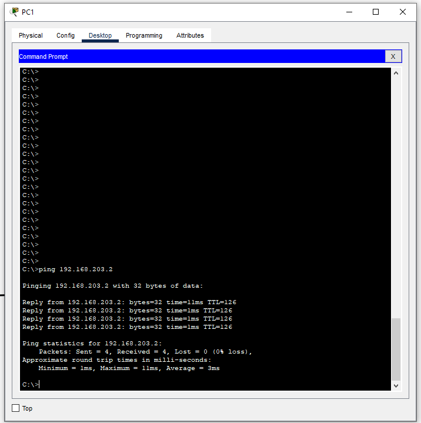

# **Práctica 2**
### Universidad de San Carlos de Guatemala
### Facultad de Ingeniería
### Escuela de Ciencias y Sistemas
### Redes de Computadoras 1
<br></br>

## **Manual**
<br></br>

| Nombre | Carnet | 
| --- | --- |
| Damián Ignacio Peña Afre | 202110568 |
----

## **Introducción**

Se realizó la siguiente topología de red:


Como siguiente pasó, se procedió con la configuración de PC's, switches y routers. Debido a que mi carnet es 202110568, y que mi numero de grupo es el 6, la las ip's de los dispositivos quedaron de la siguiente manera: `192.168.xn.0` o `172.xn.0.0`

con `x=6+6+8=20` y `n` variando según el dispositivo.

| Maquina | Dirección Ip | Gateway |
|:--------------:|:-------------:|:-------------:|
|1|    192.168.201.0/24   | 192.168.201.1|
|2|    192.168.201.0/24   | 192.168.201.1| 
|3|    192.168.202.0/24   | 192.168.202.1|
|4|    192.168.202.0/24   | 192.168.202.1| 
|5|    192.168.203.0/24   | 192.168.203.1| 
|6|    192.168.203.0/24   | 192.168.203.1|

|Conexión| Dirección de Red  |  Primera Direccion Asignable |   Gateway |
|:--------------:|:-------------:|:-------------:|:-------------:|
|R1-R2|172.201.0.0/16|172.201.0.1|N.A.|
|R1-R3|172.202.0.0/16|172.202.0.1|N.A.|
|R2-R3|172.203.0.0/16|172.203.0.1|N.A.|

Se procedió entonces, a configurar las ips de los dispositivos:


## **Configuración de Routers**

### Router 1
```bash
    enable
    configure terminal
    hostname R1
    interface gigabitEthernet 0/0
    ip address 192.168.202.1 255.255.255.0
    no shutdown
    interface serial 0/0/0
    ip address 172.201.0.1 255.255.0.0
    no shutdown
    interface serial 0/0/1
    ip address 172.202.0.1 255.255.0.0
    no shutdown
    exit
    ip route 192.168.203.0 255.255.255.0 172.201.0.2
    ip route 192.168.201.0 255.255.255.0 172.202.0.2
    exit
    enable
    copy running-config startup-config
```


### Router 2
```bash
    enable
    configure terminal
    hostname R2
    interface gigabitEthernet 0/0
    ip address 192.168.203.1 255.255.255.0
    no shutdown
    interface serial 0/0/0
    ip address 172.201.0.2 255.255.0.0
    no shutdown
    interface serial 0/0/1
    ip address 172.203.0.1 255.255.0.0
    no shutdown
    exit
    ip route 192.168.202.0 255.255.255.0 172.201.0.1
    ip route 192.168.201.0 255.255.255.0 172.203.0.2
    exit
    enable
    copy running-config startup-config
```


### Router 3
```bash
    enable
    configure terminal
    hostname R3
    interface gigabitEthernet 0/0
    ip address 192.168.201.1 255.255.255.0
    no shutdown
    interface serial 0/0/0
    ip address 172.202.0.2 255.255.0.0
    no shutdown
    interface serial 0/0/1
    ip address 172.203.0.2 255.255.0.0
    no shutdown
    exit
    ip route 192.168.202.0 255.255.255.0 172.202.0.1
    ip route 192.168.203.0 255.255.255.0 172.203.0.1
    exit
    enable
    copy running-config startup-config
```

## **Comprobación de conectividad**

### PC's red `192.168.201.0`





### PC's red `192.168.202.0`


### PC's red `192.168.203.0`


